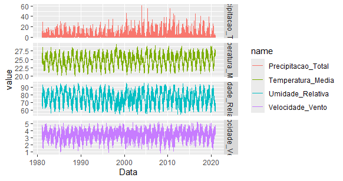
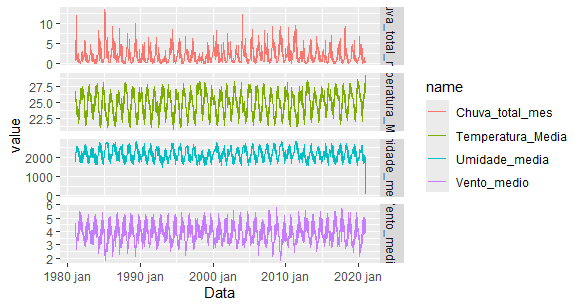
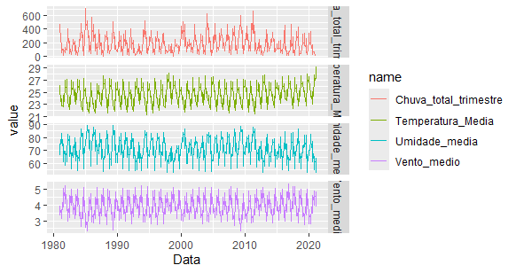

# Um Estudo Geoespacial do Município de Queimadas-PB

A compreensão da dinâmica climática é de extrema importância, especialmente para municípios cuja economia regional é altamente dependente desse fator. Esse é o caso de diversas cidades de pequeno e médio porte do interior paraibano, que apresentam características climáticas marcantes e singulares.

A base de dados utilizada abrange a região do Cariri Oriental da Paraíba, composta por 12 municípios. No entanto, o escopo desta análise se limitará exclusivamente ao município de Queimadas-PB.

O objetivo central deste estudo é investigar a existência de correlações entre as variáveis selecionadas e, a partir desses dados, obter uma compreensão mais aprofundada sobre o comportamento climático local.

Para isso, serão analisadas as seguintes variáveis:

-   Temperatura Média - 2m (ºC)

-   Precipitação Total Corrigida - (mm/dia)

-   Velocidade do vento - 2m (m/s)

-   Umidade Relativa (%)

## Série das Variáveis

Por questões de compreensão, iremos análisar as mesmas variáveis em diferentes níveis de agregassão, neste caso, diário, mensal e trimestral.

### Obsevando a partir de uma captação temporal **diária**

{width="700"}

Observações:

De foram geral, as variáveis apresentam uma grande variabilidade. Isso nos leva a supor que a familida de modelos adequados para esta situação são os modelos GARCH. De maneira análoga, será feito o teste de hipotese para que seja possível concluir a presença (ou ausencia) do efeito GARCH nas séries.

### Obsevando a partir de uma captação temporal **mensal**

{fig-align="center" width="700"}

### Obsevando a partir de uma captação temporal **trimestral**

{width="700"}

## Estacionariedade

Como todo estudo do campo de Séries Temporais, inicialmente verificar se há tendencia em algumas das séries para ter um suporte maior no momento de escolhermos os melhores candidatos que devem ser testados na modelagem.

Logo, faremos o teste estatístico para verificar se há ou não tendência nas nossas variáveis.

Temos as seguintes hipoteses:

-   ***H0:*** A série é estacionária (em nível ou tendência).

-   ***H1:*** A é série é não estacionária (possui raiz unitaria).

| Município | Variável           | Estatistica KPSS | P-Valor KPSS |
|-----------|--------------------|------------------|--------------|
| Queimadas | Precipitacao_Total | 0.1655423        | 0.10000000   |
| Queimadas | Temperatura_Media  | 1.3927623        | 0.01000000   |
| Queimadas | Umidade_Relativa   | 0.6245997        | 0.02040003   |
| Queimadas | Velocidade_Vento   | 0.6195390        | 0.02086009   |

**Observação:** o teste foi feito apenas na série **diária**.

## Testando Efeito GARCH

Observação:

-   adicionar os testes

    \
    Todas as variáveis apresentaram a presença do efeito GACH, logo, temos o nosso primeiro principal candidato para modelas nossas séries.

Antes de partir para a fase de modelagem, vamos verificar se alguma das séries tem Sazonalidade e Tendência.

## Estudo da Sazonalidade
